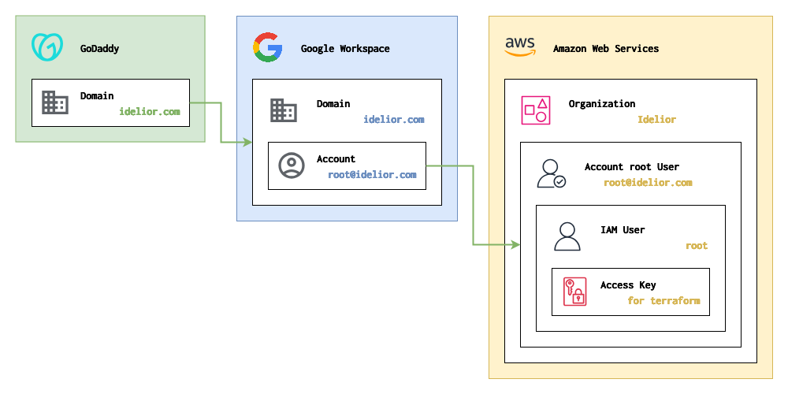
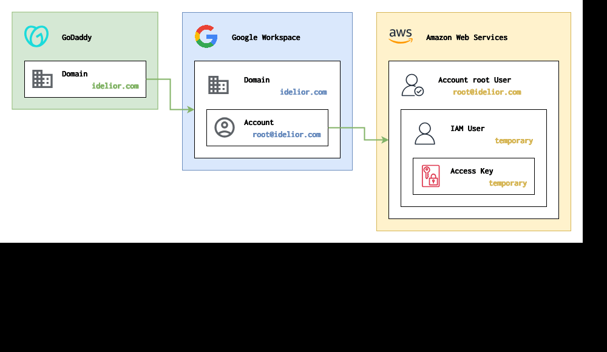

# Infrastructures - Initialization

## Overview

This document describes the process of starting the infrastructure setup.

## Objectives

- **Create IAM Users and Access Keys for Managing AWS Root Account Using Terraform**: Use Terraform to create IAM users and access keys to automate and structure AWS root account operations.

- **Establish AWS Organization**: Configure an AWS Organization via Terraform to set up the foundational structure.

### Diagram



## Steps

### Manual Setup (Must be done first)


1. Purchase the `idelior.com` domain from GoDaddy.
2. Sign up for Google Workspace using the `idelior.com` domain.
3. Create the `root@idelior.com` Google account.
4. Sign up for AWS using `root@idelior.com`.
5. Create a temporary user in IAM.
6. Attach the `AdministratorAccess` policy to the temporary user.
7. Generate an access key for the temporary user.

> **Note**: The reasons for using a temporary user are as follows:
> 1. **Process can be done through the web console**: The process of creating a temporary user can be easily completed through the AWS web console, allowing for quick and straightforward access during the initial setup phase.
> 2. **Easier management with Terraform**: Although it's possible to import existing resource states into Terraform, creating a temporary user allows for consistent management of infrastructure tasks through Terraform. This approach facilitates easier automation and tracking of the infrastructure setup.

### Execute `init.sh`



After completing all the preparation steps, execute `init.sh` to configure AWS environment using Terraform.

> **Requirement**: Before running the `init.sh` script, ensure that both AWS CLI (`aws`) and `jq` are installed and properly configured on your system.

1. **Ensure Execution Permissions**: Before running the script, make sure it has the appropriate execution permissions:
    ```bash
    chmod +x init.sh
    ```

2. **Execute the Script**: Run the script to apply the Terraform configurations:
    ```bash
    ./init.sh
    ```

3. **Verify Completion**: Check the output of the script to ensure that all configurations have been applied successfully and verify that the AWS environment is set up as expected.

## Terraform

### Requirements

No requirements.

### Providers

| Name | Version |
|------|---------|
| <a name="provider_aws"></a> [aws](#provider\_aws) | 5.63.1 |

### Modules

No modules.

### Resources

| Name | Type |
|------|------|
| [aws_iam_access_key.root](https://registry.terraform.io/providers/hashicorp/aws/latest/docs/resources/iam_access_key) | resource |
| [aws_iam_user.root](https://registry.terraform.io/providers/hashicorp/aws/latest/docs/resources/iam_user) | resource |
| [aws_iam_user_policy_attachment.root](https://registry.terraform.io/providers/hashicorp/aws/latest/docs/resources/iam_user_policy_attachment) | resource |
| [aws_organizations_organization.default](https://registry.terraform.io/providers/hashicorp/aws/latest/docs/resources/organizations_organization) | resource |
| [aws_iam_policy.administrator_access](https://registry.terraform.io/providers/hashicorp/aws/latest/docs/data-sources/iam_policy) | data source |

### Inputs

No inputs.

### Outputs

No outputs.
